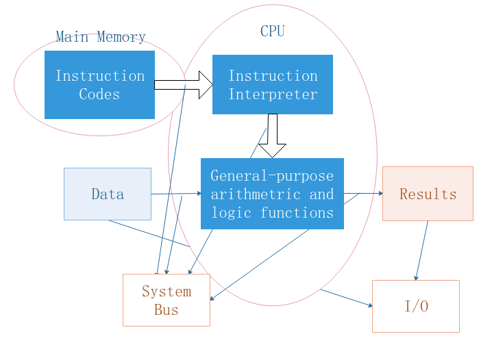

# 第一章： Computer Organization and Architecture
## 核心要点
### **computer organization 和 computer architecture的比较**

||可见性|设计方式|
|---|---|---|
|Organization|性质被系统设计者(system designer)可见|逻辑设计的一种实现(an implementation)|
|Architecture|性质被编程者(programmer)可见|计算机的逻辑设计(logic design)|

### **Transparency 基本概念**

对于存在的事物或者某些性质，从一个视角来看，它们就像不存在一样。就比如说，我们知道QQ收发消息过程经过了复杂的操作，但是从用户角度来看，只看到了消息的收发，复杂的信息传递方式以及协议就好像不存在一样。

### **Compatibility 基本概念**

兼容性包含向上兼容和向后兼容两方面的内容。向上兼容是指较为低级的计算机能够不加修改地在较为高级的计算机上运行；向后兼容指的是当前的程序可以不加修改的在未来的程序上运行。

值得注意的是，上述两种兼容性的表述仅仅针对的是同一种结构的计算机，也就是序列机。

**序列机(Sequence Machine)**: 相同architecture而不同organization的计算机的集合。

### **computer structure 和 computer functions 基本概念**

- structure. 不同组分(components)之间交互的方式(the way in which the components are related to each other).

- function. structure中的每个组分的操作(the operation of each individual compoent as part of the structure).

computer function 包含如下四个方面的内容：

- 数据处理(Data Processing)
- 数据存储(Data Storage)
- 数据转移(Data Movement)
- 控制(control)

### **一个normal computer 的主要构成(main components)**以及**CPU 和 CU的主要构成**

# 第二章： Computer Evolution and Performance
## 核心要点
### 世界第一台电脑的基本情况
世界第一台通用计算机是ENIAC, 其设计制造开始于1943年，完成于1946年。其能够实现条件跳转，并且是可编程的。同时其仿照人的习惯，采取的是十进制数据存储。

### 冯诺依曼机的基本特征及其结构
冯诺依曼机也就是IAS计算机的结构，虽然最后宣告失败，但是冯诺依曼机的思想却广受使用，典型的冯诺依曼机由MM, ALU, I/O, CU四部分构成。如下图：

  

 

**关于IAS计算机的细节以及其扩展结构的了解掌握程度？**

### 摩尔定律
摩尔定律的最经典形式为： Numbers of transistors on a chip will double every year. 表示的是硬件发展规律的实验性结论。

### 典型计算机分类
- Chip Microcomputer
- Single Board Computer
- Embedded Computer
- Microcomputer
- Server
- Super Computer

以上按照其规模以及处理能力进行的典型计算机的分类。

# 第三章： A Top-Level View of Computer Function and Interconnection
### 冯诺依曼机的三个核心概念：

- 数据和指令存储在同一个可读可写内存中 (Data and instruction are stored in a single read-write memory)

- 内存中的内容通过具体位置来寻址 (The contents of the memory are addressed by location)

- 指令序列化执行 (Execution occurs in a sequence fashion)

### High-level Programming Model

### 中断与指令周期 (Interrupt and Instruction Cycles)
指令周期是执行一条指令所需要的CPU时间，其由取指周期(Fetch Cycle)和执行周期(Execute Cycle) 两部分构成。

中断是一种允许其他模块打断CPU常规执行序列的机制 (A mechanism allowing other module to break CPU executing sequence)。

**中断的优势**：

- 提高了CPU的利用率
- 允许CPU执行更为重要的任务

**中断的类型**:

- 程序中断：溢出，除零等
- 时间片中断： 单CPU并发执行多个任务
- I/O 中断：I/O 控制问题
- 硬件失效： 存储异常等

**Short I/O Wait & Long I/O Wait**

短时I/O中断是

**中断发生程序完成的事项**

# 第四章：Cache Memory
## 核心要点
### 内存访问的四种方式
- 顺序访问(Sequential): 从头开始，然后按照一定的顺序访问。如磁带。
- 直接访问(Direct): 每个内存块都要独立的地址，可以直接进行跳转。如光盘，磁盘。
- 随机访问(Random): 不从头开始，随即开始，access time与位置和之前位置无关。如DRAM。
- 关联访问(Associative): 随机访问的一种，将部分内容进行比对，然后访问。如cache。

### 内存访问的几个关键时间
- Access Time: 将数据从内存中取出的时间(the time of getting data out of memory)

- Memory Cycle Time: access time + Address transient change time(地址顺变时间) -- 在随机内存访问中使用.

- Transfer Rate: 每秒钟将数据换入或者换出主存单元数。

### 什么是Memory Hierarchy, 其根据什么执行
Memory Hierarchy 是为了权衡主存速度、价格和容量之间的矛盾而设计的。其具有external memory --> main memory --> caceh的层次结构，访问速度逐渐提升，存储容量逐渐减小。

实现内存的层级结构的实践依据是内存的局部性原理(principle of locality of reference)。

**内存的局部性原理**：在程序执行的过程中，CPU是对指令和数据进行批量获取的。

其理论依据为：一方面程序可能有较多的循环以及子程序，或者是以表的形式或数组的形式访问，其需要聚类的数据；另外一方面，程序和数据往往是序列化放置的，因此

### Block 能够被放在 Cache的哪里
### Block如何在Cache中找到
### 如果发生Cache中Block的缺失，哪个Block将被替换
### Cache中的写机制怎么样
