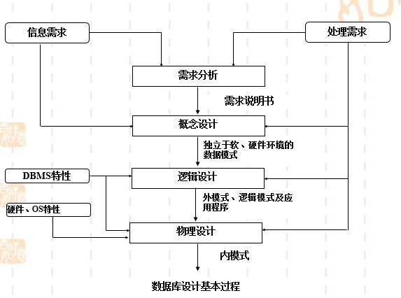
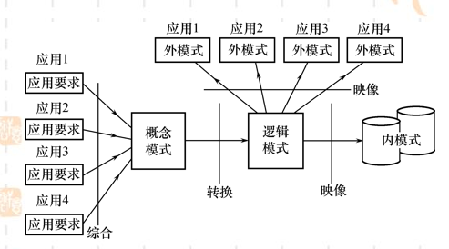

# 概述
## 数据库系统生命周期
数据库设计是数据库系统生命周期中最为重要的部分。
数据库设计的**核心**是根据用户的**信息需求**和**处理需求**设计出系统的数据库模式和应用软件。

数据库的生存周期有如下几个阶段：
- 系统规划
- 数据库设计(后面会提到)
- 系统实现(编码与测试)
- 运行和维护

## 数据库设计的六个阶段
- 需求分析
- 概念设计
- 逻辑设计
- 物理设计
- 编码实现与测试
- 运行维护

关于其形象化的说明我们可以参看下图：数据库设计的基本过程

## 数据库设计过程的各级模式

其中，概念模式相当于外模式，逻辑模式相当于模式，而物理模式相当与内模式。。

# 需求分析
## 需求分析的任务
- 详细调查现实世界要处理的对象
- 充分了解原系统(无论手工系统还是计算机系统)
- 明确用户的各种需求(信息需求，处理需求，安全性需求等)
- 确定新系统的功能
- 充分考虑今后可能的扩充和改变(这一点往往较难)
- 编写需求分析说明书

## 需求分析的重点
需求分析的重点是用户的**信息**和**处理**，也就是获得用户对于数据库的**真实**要求。

## 需求分析的难点
确定用户的真实需求的难点主要有两个方面的内容。一方面是用户缺少计算机相关知识；另一方面是设计人员缺少用户的专业知识。解决的方法是设计人呀un必须不断深入地与用户进行交流。

在对用户需求进行分析的时候，我们还要充分考虑**需求分析的不确定性**。这意味着每个人在转述某一个问题时往往带有主观因素，因此有可能程序员对于软件需求的理解与用户的实际需求之间存在着巨大的差距。

## 需求分析的步骤
需求分析一般分为三步：
- 需求信息的收集
- 需求信息的分析整理(主要是进行程序猿层面的抽象--共性整理)
- 编写需求分析说明

## 需求分析的结果
- 确定系统范围，产生系统范围图
- 分析用户活动，产生业务流程图
- 分析用户活动涉及的数据，产生数据流图
- 分析系统数据，产生数据字典

# 概念设计
概念设计就是将用户需求分析阶段的结果进行共性整理与抽象。

我们一般采用E-R模型来进行概念设计。通过之前的学习知道，E-R模型一般由实体、关系和联系这三部分构成。

## 扩充的ER模型
由于现实世界中客观存在的某些事物无法通过ER模型进行准确描述，因此需要对基本的ER模型进行一些拓展。

拓展的主要内容包括：弱实体，普遍化/特殊化、范畴、聚集等扩充ER模型的概念。

### 弱实体
弱实体就是某些依附于其他实体而存在的实体。

### 普遍化/特殊化
特殊化就像将超实体集划分为多个子实体集的结果。其中，超实体集就像是程序设计中的接口或者是超类。例如学生就是一个超实体集，可以将学生分为本科生、研究生这两个子实体集。

普遍化与特殊化相反，不同之处在于特殊化形成的子实体集可以扩展其他属性，而进行普遍化的多个子实体集的**并**等于原实体集本身。

关于聚集和范畴的理解程度。。。。。完成到第39页

# 逻辑设计
# 物理设计
# IDEF 1X 方法
# 数据库实施
# 数据库运行与维护
