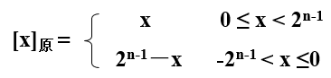
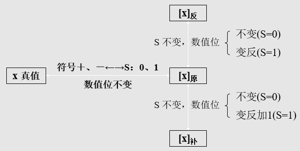

# Preface
以下内容为西安交通大学2015级本科生在《数字逻辑》课程相关PPT以及个人理解分析的基础之上进行了数字逻辑考前的相关知识点以及解题思路的总结。由于本人能力有限，其中不乏有许多缺漏之处，敬请读者批评指正。

我将按照篇章结构分为三个四个部分进行归纳总结：

- Part I: 数字逻辑基础

	Chapter One: 数制与编码

	Chapter Two: 逻辑代数基础

- Part II: 组合逻辑电路

	Chapter Three：组合逻辑电路的分析与设计

- Part III: 时序电路

	Chapter Four: 同步时序电路的分析
	
	Chapter Five: 同步时序电路的设计
	
	Chapter Six: 异步时序电路的分析与设计

- Part IV: 现代逻辑系统简介

	Chapter Seven：可编程逻辑器件(PLD)
	
	Chapter Eight: 数字系统设计

-------------------------

# Part I: 数字逻辑基础
## Chapter One: 数制与编码
### 数制转换
数制转换共有三种方法，分别为多项式替代法，基数乘除法和直接转换法。

|方法名称|基本思想|缺点|
|---|---|---|
|多项式替代法||必须已知beta进制的数制转换特点|
|基数乘除法|整数部分除，逆序排列；小数部分乘，正序排列|必须已知alpha进制的数制转换特点|
|直接转换法|根据进制数展开为二进制|alpha与beta必须是2的指数形式|

值得注意的是，对于任意两种进制之间的转换根据特点往往首先使用多项式替代法将其转换为十进制，然后通过基数乘除法将其转换为对应的进制。

此外，在进行数制转换时不能够丢失精度，因此有：

k * log(alpha) / log(beta) <= j <=  [k * log(alpha) / log(beta)] + 1

### 二进制数的代码表示
二进制的三种代码表示均将数字分为符号位和数值位来进行计算，在真值为正数时，三种表示形式相同，而当真值为负数时才存在差异。

|代码类型|说明|表示形式|表示范围|
|---|---|---|---|
|原码|正数符号位为0，负数符号位为1，下同||-(2^n-1)~(2^n-1)|
|反码|正数数值位不变，负数数值位按位取反|||
|补码|正数数值位不变，负数数值位按位取反最后加1|||

如下是三种二进制代码的关系转换图：

 

**此处的码制的表示范围如何进行划分与确定？？？**

### 十进制数的代码表示

|码制类型|特点|十进制的表示|有权性|容错性|
|---|---|---|---|---|
|8421码||去掉后6位|有||
|2421码||去掉中间6位|有||
|余三码||去掉前后三位|无||
|格雷码|相邻数的二进制码仅有一位不同||脉冲跳转容错|
|步进码|多1位，从00000步进到10000||脉冲跳转容错|
|奇偶校验码|增加了奇偶校验位||一位校验|

- 典型格雷码与二进制码的转换 

1. 格雷码向二进制码的转换

 

2. 二进制码向格雷码的转换

## Chapter Two: 逻辑代数基础

-------------------------
# Part II: 组合逻辑电路
## Chapter Three：组合逻辑电路的分析与设计
-------------------------
# Part III: 时序电路
## Chapter Four：同步时序电路的分析
## Chapter Five：同步时序电路的设计
## Chapter Six：异步时序电路的分析与设计
-------------------------
# Part IV: 现代逻辑系统简介
## Chapter Seven：可编程逻辑器件(PLD)
## Chapter Eight: 数字系统设计
	
