# Preface
以下内容为西安交通大学2015级本科生在《数字逻辑》课程相关PPT以及个人理解分析的基础之上进行了数字逻辑考前的相关知识点以及解题思路的总结。由于本人能力有限，其中不乏有许多缺漏之处，敬请读者批评指正。

我将按照篇章结构分为三个四个部分进行归纳总结：

- Part I: 数字逻辑基础

  Chapter One: 数制与编码

  Chapter Two: 逻辑代数基础

- Part II: 组合逻辑电路

  Chapter Three：组合逻辑电路的分析与设计

- Part III: 时序电路

  Chapter Four: 同步时序电路的分析

  Chapter Five: 同步时序电路的设计

  Chapter Six: 异步时序电路的分析与设计

- Part IV: 现代逻辑系统简介

  Chapter Seven：可编程逻辑器件(PLD)

  Chapter Eight: 数字系统设计

-------------------------

# Part I: 数字逻辑基础
## Chapter One: 数制与编码
### 数制转换
数制转换共有三种方法，分别为多项式替代法，基数乘除法和直接转换法。

| 方法名称   | 基本思想                                | 缺点                  |
| ------ | ----------------------------------- | ------------------- |
| 多项式替代法 | 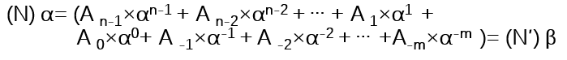 | 必须已知beta进制的数制转换特点   |
| 基数乘除法  | 整数部分除，逆序排列；小数部分乘，正序排列               | 必须已知alpha进制的数制转换特点  |
| 直接转换法  | 根据进制数展开为二进制                         | alpha与beta必须是2的指数形式 |

值得注意的是，对于任意两种进制之间的转换根据特点往往首先使用多项式替代法将其转换为十进制，然后通过基数乘除法将其转换为对应的进制。

此外，在进行数制转换时不能够丢失精度，因此有：

k * log(alpha) / log(beta) <= j <=  [k * log(alpha) / log(beta)] + 1

### 二进制数的代码表示
二进制的三种代码表示均将数字分为符号位和数值位来进行计算，在真值为正数时，三种表示形式相同，而当真值为负数时才存在差异。

| 代码类型 | 说明                    | 表示形式                | 表示范围             |
| ---- | --------------------- | ------------------- | ---------------- |
| 原码   | 正数符号位为0，负数符号位为1，下同    |  | -(2^n-1)~(2^n-1) |
| 反码   | 正数数值位不变，负数数值位按位取反     | 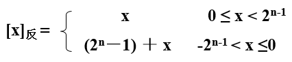 |                  |
| 补码   | 正数数值位不变，负数数值位按位取反最后加1 | 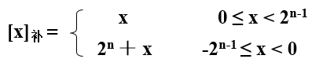 |                  |

如下是三种二进制代码的关系转换图：

 

**此处的码制的表示范围如何进行划分与确定？？？**

### 十进制数的代码表示

| 码制类型  | 特点                 | 十进制的表示 | 有权性  | 容错性    |
| ----- | ------------------ | ------ | ---- | ------ |
| 8421码 |                    | 去掉后6位  | 有    |        |
| 2421码 |                    | 去掉中间6位 | 有    |        |
| 余三码   |                    | 去掉前后三位 | 无    |        |
| 格雷码   | 相邻数的二进制码仅有一位不同     |        |      | 脉冲跳转容错 |
| 步进码   | 多1位，从00000步进到10000 |        |      | 脉冲跳转容错 |
| 奇偶校验码 | 增加了奇偶校验位           |        |      | 一位校验   |

- 典型格雷码与二进制码的转换 

1. 格雷码向二进制码的转换

 

2. 二进制码向格雷码的转换

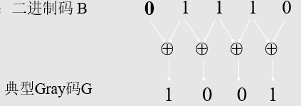

## Chapter Two: 逻辑代数基础
### 逻辑代数基础

| 类型名称     | 性质内容                         | 备注                     |
| -------- | ---------------------------- | ---------------------- |
| 基本逻辑运算   | 与或非                          | ---                    |
| 逻辑代数基本公理 | 特别注意：1+1=1,A+(BC)=(A+B)(A+C) | ---                    |
| 逻辑代数基本定理 | 吸收定理，结合定理，反演定理，多余项定理(难点)     | 看书                     |
| 三个规则     | 代入规则，反演规则，对偶规则               | 其中反演规则会将变量取反，而对偶规则变量维持 |

### 复合逻辑
逻辑函数可以由真值表，逻辑表达式和卡诺图三种形式进行表示。

复合逻辑具有与非逻辑(NAND)、或非逻辑(NOR)、与或非逻辑(AOI)、异或逻辑(XOR)等。

关于其符号进行重点记忆，特别是注意异或符号以及与或非符号。

### 最小项与最大项
- 最小项：逻辑变量积的形式
- 最大项：逻辑变量和的形式

### 最大、小项标准式
- 最大项标准式：或与标准式
- 最小项标准式：与或标准式

最小项标准式中正变量记为1，而最大项标准式中反变量记为1，最小项标准式和最大项标准式的关系是下标互补。

### 逻辑函数的化简
- 逻辑函数化简的原则： 最简逻辑电路，最简与或式，最简或与式
- 逻辑函数化简方式：代数法化简，卡诺图法化简

**此处是否考察代数法化简？？**

卡诺图法化简的基本流程参见课本，较为简单，周二复习。

remain to be seen.

-------------------------
# Part II: 组合逻辑电路
## Chapter Three：组合逻辑电路的分析与设计
### 组合逻辑电路分析的一般步骤
- 根据逻辑电路图写逻辑表达式
- 使用卡诺图化简逻辑表达式
- 列出真值表
- 分析电路的功能
- 尝试进行电路改进

如下以图片的形式直观地呈现了组合逻辑电路分析的一般步骤：

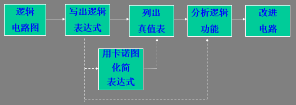

### 组合逻辑电路设计的一般步骤
组合电路的设计步骤大部分可以认为是组合电路分析的反过程，其步骤如下：

- 根据需求明确任务
- 列出真值表
- 通过卡诺图化简得到最简逻辑表达式
- 根据所选门类型进行表达式转换
- 画出逻辑电路图

如下以图片的形式直观地呈现组合逻辑电路设计的一般步骤：

### 必须掌握的几个逻辑电路的分析与设计
| 所属类型   | 电路功能                               | 基本内容                                     |
| ------ | ---------------------------------- | ---------------------------------------- |
| 码制转换   | 2421码, BCD码，Gray码，8421码，余三码之间的相互转换 | 重点是分清各个码制的无关项，利用卡诺图进行化简                  |
| 电路应用   | 设计7人宿舍的灯控电路                        | 采用数学归纳法，得到其就是多对象异或电路                     |
| 加法器    | 半加器，全加器                            | 半加器Sh = A NOR B, Ch = AB, 全加器 Si = A nor B nor C(i-1), Ci = AB + AC(i-1) + BC(i-1) |
| 比较器    | 原理较为基础                             | ---                                      |
| 二进制乘法器 | 原理较为基础                             | ---                                      |

特别注意：在使用半加器进行全加器设计的时候，利用吸收率将Ci = AB + AC(i-1) + BC(i-1) 转换为 AB + A^BC(i-1) + ^ABC(i-1)，然后进行电路设计即可。

### MSI基本介绍
MSI--中规模集成电路，在进行电路设计时，不再以两个、四个触发器等形式作为基本单元进行设计，而是以更多的元件为基本单元进行硬件设计。其外部引腿可以分为**控制使能类**和**数据地址类**两种。

### 重点MSI器件

| 器件类型  | 器件名称       | 器件特点                      | 其他事项                                   |
| ----- | ---------- | ------------------------- | -------------------------------------- |
| 译码器   | 译码器138，139 | 译码器是后面包括全加器，数据分配器的核心，普遍适用 | 输出仅有一根引脚有效，2-4译码器(两个就是139)，3-8译码器(138) |
| 数据分配器 | ---        | 将译码器倒过来用                  | ---                                    |
| 多路选择器 | 151        | ---                       | ---                                    |
| 比较器   | 比较器86      | ---                       | 译码器的引端选择性连接                            |
| 加法器   | 加法器283     | ---                       | 译码器的引端选择性连接                            |

1. 译码器的级联

5输入-32输出译码器：1个2-4译码器，4个3-8译码器

2. 加法器

将3-8译码器的引端选择性相连

3. **三态缓冲器的用途进行详细分析！！！考察的难度范围** 

4. 多路选择器----在N路中选择一路进行数据传输

5. 将多路选择器的不同连接表示可以实现任意组合逻辑函数。

其后部分未完待续。。。。

-------------------------
# Part III: 时序电路
## Chapter Four：同步时序电路的分析
### 时序电路基本概念
- 时序电路和组合电路的异同
  组合电路的输出仅与当前状态有关，而时序电路的输出不仅与当前状态有关，还与之前状态有关；
- 同步时序电路和异步时序电路的异同
  同步时序电路是指输入信号都是在同一个时钟周期送来的，而异步时序电路则是指信号在不同周期内送至

- Mealy型电路和Moore型电路的异同
  Mealy型电路的输出不仅与现态有关，还与输入有关；而Moore型电路的输出仅仅与现态有关。这种差异也导致了其在研究方法上的差异。

### 时序电路的分析方法
- 次态方程：次态与现态和输入的关系方程
- 次态真值表：左边为输入和现态，右边为次态
- 次态卡诺图：
- 状态表：将x，y等均转变为0,1
- 状态图：更直观的形式，便于分析电路的逻辑功能

特别注意的是Mealy型电路的输入x与输出是相伴相生的，而由于Moore型电路的输出与输入无关，因此在状态表中输出与输入无关。

### 双稳态元件
双稳态元件就是可以存放一个二进制数，同时当外界有一个脉冲时可以从一个状态跳转到另一个状态的元件。

以下是各种双稳态元件的演变过程：

| 元件名称         | 电路图                                      | 逻辑符号                       | 缺陷               |
| ------------ | ---------------------------------------- | -------------------------- | ---------------- |
| S-R触发器       | 较为简单， 实现稳态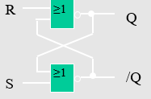          |      | 有双1禁止，有空翻        |
| 带使能端S-R触发器   | 增加了使能端                                   | ---                        | 所有S-R均不建议使用      |
| **D触发器**     | 将S-R通过非逻辑逻辑解决了双1禁止， 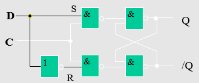  | 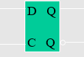       | 有空翻              |
| **边沿触发D触发器** | 解决了空翻问题                                  | 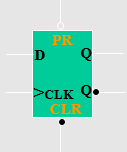       | PR强制置1端，CLR强制置0端 |
| 主从S-R触发器     | 两个SR通过CLK的脉冲非逻辑解决空翻 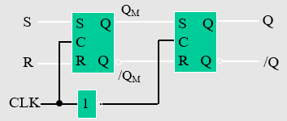 | ---                        | 在CLK有效时可能会发生数据错误 |
| 主从J-K触发器     | 在主从SR基础之上将Q正端反端与S-R分别相连 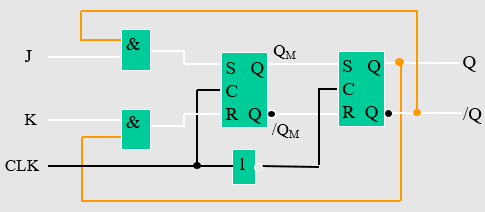 | ---                        | 功能强大             |
| 边沿触发J-K触发器   | 通过D触发器的边沿特性将其改变为边沿触发                     |  | 更有效地致使数据维持       |
| T触发器         | 每当一个CLK脉冲过来，若T送1，则Q端变反 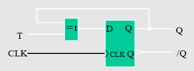          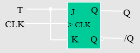 | 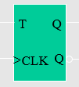       | 计数触发器            |

### 同步时序电路分析步骤
1. 列出激励函数以及输出函数表达式
2. 次态方程
3. 二进制状态表
4. 二进制状态-输出表
5. 状态-输出表(二进制分配字母)
6. 状态图
7. 电路特性描述

详细分析见本章PPT中的三个经典例题。

关于时序图了解的程度如何？？？

### 挂起问题的解决
电路挂起：无效序列无法回归到有效序列的现象

电路挂起的解决思路：
1. 无效序列的状态无关项全部指向0：一般不采取，成本太高，电路复杂度加大；
2. 打断一处“无效序列链”，令其指向有效序列；
3. 改变某一触发器的输入网络，同时进行最简设计

往往在实际进行解挂的过程中，“断链”和“改变输入网络”是同时进行的，最经典的实例就是Johnson计数器的设计(自恢复扭环移位计数器)。

注意典型的方法是利用无关项，进行输入网络的修改(也就是将所有无关项)。同时根据置0型和置1型的差异来进行无关项的选择。思路相当精巧。

### 计数器
#### 基础计数器
计数器可以分为加1计数器，减1计数器，可逆计数器三类。其中这三类计数器都可以通过D触发器，JK触发器和T触发器进行设计实现，但是出于实际简便需要，因此往往采用D触发器进行设计。

设计实现的思路大致相同，以下按照CLK脉冲的同步性分串行计数器和并行计数器两类进行分析：

1. 串行计数器

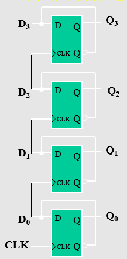

如上所示是串行加法器，通过修改向下级呈递的连接的从Q到^Q, 或者是修改为后端触发，都可以将其转换为串行减法器。

2. 并行计数器

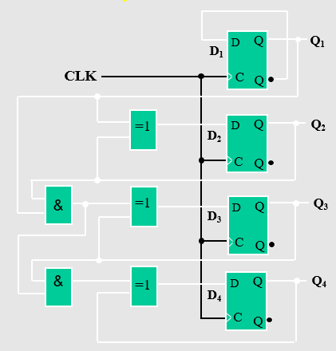

如上所示即是用D触发器实现的并行计数器，通过修改Q端以及后端触发的形式，也可以将其转变为串行减法器。

74169是一个可逆计数器，通过UP/DOWN端口为1时，为+1计数，而当为0时为-1计数。

一般而言，上述设计出来的计数器都是2^n型计数器，如果要设计任意位计数器，则可以采用如下的方式：

#### 任意位计数器
- 强制位计数器
- 预置位计数器
- 修正式计数器

1. 强制位计数器就是当计数器首次进入无效状态时，通过设计的一个与非门判别器，通知D触发器的置1端和置0端实现初始化，跳转到有效状态。

2. 预置位计数器就是当计数器进入起跳状态时，对相应的现态Di进行预置，当时钟脉冲到达时，马上进行跳转到初始状态；

3. 修正式计数器就是将预置位计数器得到的结构进行化简，以最简的形式设计的电路。

我们通过分析比较三者差异可以知道，强制位计数器由于允许有一个短暂的无效状态的存在，缩短了初始状态的时间，但是其同步和异步两种形式都可以使用，虽然预置位计数器可以解决无无效状态出现的问题，但是却只能在异步计数器中使用。

#### MSI计数器(163)及其应用
74163的结构如图所示：

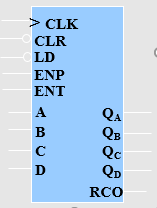

通过对RCO端的串联可以实现163的级联，通过LD的选择性可以实现任意模数的计数器。

### 节拍分配器
关于计数型节拍分配器和移位型节拍分配器的具体介绍，待后续进行复习。

## Chapter Five：同步时序电路的设计

同步时序电路的设计过程恰好是同步时序电路分析的反过程，书上的三个经典的实例基本可以解释遇到的类似的所有问题了，要将相关的问题吃透。

### 同步时序电路设计过程

- 建原始状态图和状态表
- 化简成最简状态表
- 分配状态二进制，将其转换为二进制表
- 选择触发器, 确定激励函数和输出函数
- 画出逻辑电路图

#### 原始状态图和原始状态表

不求最简，只求正确。也就是通过该状态图可以实现数字系统的逻辑功能。

#### 最简状态表

如果所有状态均确定，也就是没有无关量，则通过隐含表(掐头去尾表)和依赖表，然后根据其找到最大等效类；如果状态的输出含有无关变量，则通过隐含表和依赖表找到最大相容类。

无论是等效还是相容，判定上的相似的，都是要求两条，一个是输出相同，第二个是通过各种转换最后都来自与同一个祖先。但是值得注意的是，等效关系存在传递性，而相容关系不存在传递性。

状态合并之后我们再来寻找最小化状态表。

最小化状态表满足的条件：

- 覆盖性：包含全部的原始状态；
- 闭合性：任意一个相容类的次态应该属于集合中的相容类；
- 最小化：满足覆盖性和闭合性关系的相容类或者是等效类的个数最少

#### 状态分配

由于通过相关计算，待分配的状态数目较大，但是有许多的状态是等效的，因此我们仅仅需要找到次佳的分配状态即可，因而可以通过如下的计算方法进行状态分配问题的解释：

- 分配规则

1. 输入相同，次态相同，现态相邻；
2. 输入相邻，现态相同，次态相邻；
3. 输出相同，现态相邻。

具体表现为如下公式：

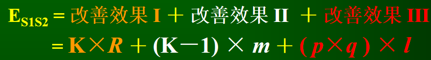

其中K为状态变量数，P为输入组合数，Q为输出组合数。

将得到的权值最大的状态之间相邻，同时也使其尽量出于低位，也就是状态分配时含0最多。

#### 触发器选择

在进行触发器的选择时，如果不对功能有特殊的要求，那么选择最为简单的D触发器，如果需要较为强大的功能，则可以选用JK触发器。

如上即是同步时序电路分析的基本方法，虽然设计思路总体而言较为复杂，但是实际上方法相对单一，便于掌握。

## Chapter Six：异步时序电路的分析与设计

异步时序电路与同步时序电路最大的区别是，异步时序电路的输入是不同步的，也就是说CLK有多个进行控制，因此在进行整个逻辑电路分析与设计的过程中，要注意将CLKi纳入初始状态。

周三将第五、六章的所有习题重新再做一遍。然后周四下午答疑，从此以后也就完成了数字逻辑的所有复习任务。

-------------------------
# Part IV: 现代逻辑系统简介
## Chapter Seven：可编程逻辑器件(PLD)

### PLD电路模型
ROM，PLA, PAL之间的异同

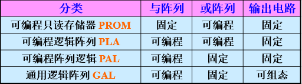            

其中，ROM与阵列固定，或阵列可编程；PLA与或阵列都可编程，但是却大大提升了编程难度，因此后来引申出了可编程阵列逻辑，或阵列可以编程，进行私人定制。

关于ROM的了解应该达到何种程度？？？

### 数字系统电路模型

## Chapter Eight: 数字系统设计

数字系统设计的掌握程度应该到什么程度？
